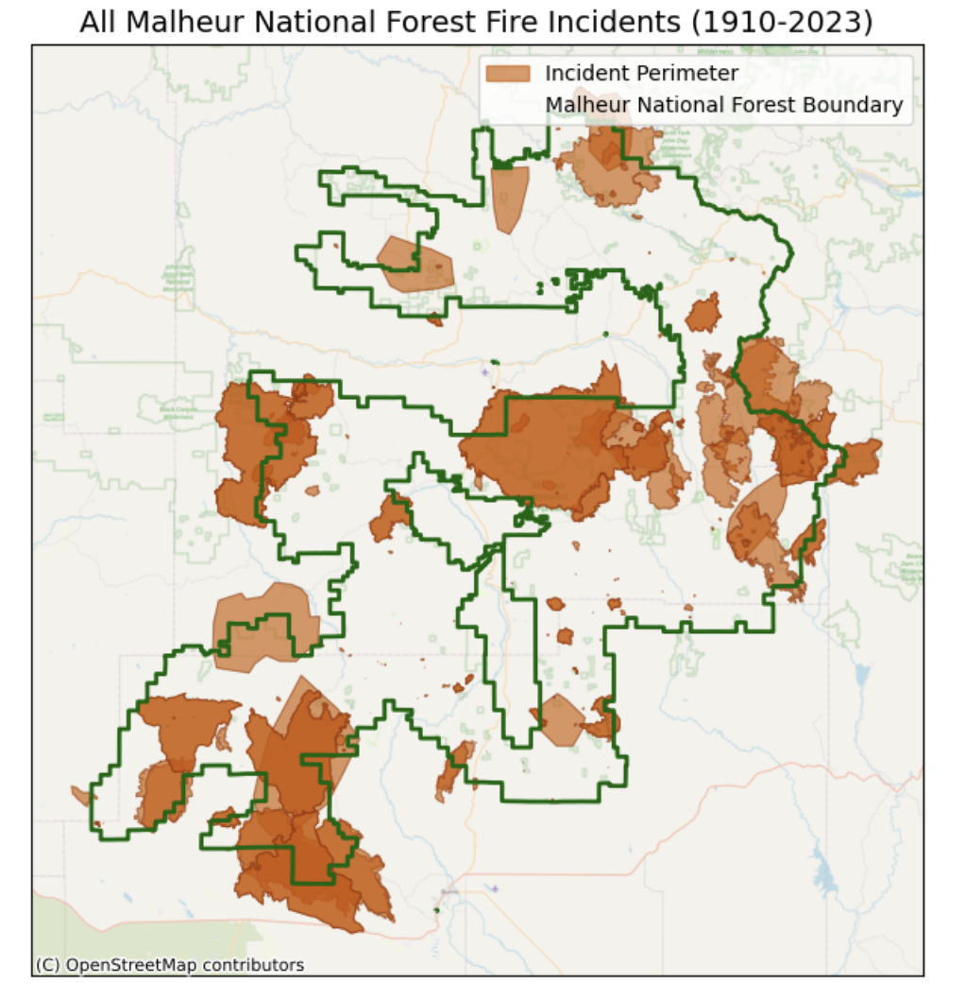
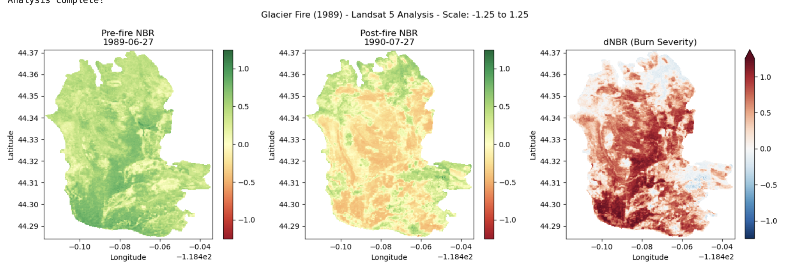
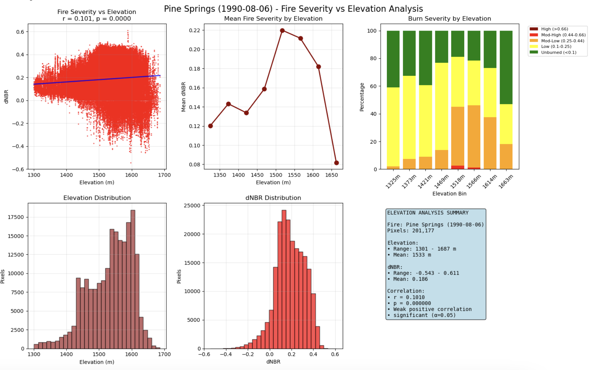

# 🔥 Fire Severity Analysis and QA/QC Toolkit

## Project Summary

This repository provides geospatial tools and workflows to evaluate historical wildfire severity, data quality, and disturbance interactions—particularly spruce budworm outbreaks and their relationship with fire vulnerability—in the Pacific Northwest. The project uses Landsat satellite imagery and geospatial datasets to compute differenced Normalized Burn Ratios (dNBR) and clean overlapping and duplicate fire perimeter records for accurate statistical modeling.


---

## Team Members

* Rachel Potter
* Iris Mire

---

## **Background and Motivation**

Fires are mediated by a number of abiotic and biotic factors, and understanding and prediciting there severity is a key challenge. In addition, numerous agencies collect fire data, which results in overlapping or partially contridicting information, which makes analysis even more challenging. There are also numerous competitng measures of fire severity, which can lead to different conclusions. We thus set out to develop a set of tools to help make this data cleaning and analysis process easier.

We focus on a case study in the Malheur National Forest to evaluate data quality and look at the influence of Western spruce budworm, which had a large outbreak in the 1980s. Western spruce budworms are defoliators that consume conifer needles, particularly in **spruce and fir forests**. Over several years of infestation (3–10 years), trees experience stress due to reduced foliage, potentially making them more flammable. However, herbivory may also reduce the amount of flammable material. Understanding how these outbreaks interact with climate variability and fire regimes is crucial for forest management and wildfire mitigation.



---

## Key Research Questions ❓

* Can we develop reproducible tools for identifying and removing duplicate fire records?
* What can dNBR patterns tell us about fire recovery over 1-, 2-, and 5-year periods?
* How do spruce budworm outbreaks influence fire severity and vulnerability in Pacific Northwest forests?
* How do fire patterns vary across elevation gradients?


---

## Datasets Used 📂

* **🌲 USFS Forest Health Monitoring Program** — Spruce budworm outbreak polygons
* **🛰️ NASA MODIS / Landsat 5** — Remote sensing data for fire detection and NBR analysis (accessed via Microsoft Planetary Computer STAC API)
* **🔥 National Interagency Fire Center (NIFC)** — Historical fire perimeters

---

## Tools & Libraries 🛠️

### Python Libraries 🐍

* **Geospatial Processing**: `geopandas`, `rasterio`, `rioxarray`, `shapely`, `fiona`, `xarray`
* **Data Wrangling**: `pandas`, `numpy`
* **Visualization**: `matplotlib`, `contextily`
* **Remote Sensing & Planetary Computer**: `pystac_client`, `planetary_computer`
* **Widgets (for interactive dev)**: `ipywidgets`

---

## Methodology

### QA/QC on Fire Perimeter Data 🔥

* Identify and remove **duplicate fire perimeters** based on spatial overlap, `INCIDENT` name, and `FIRE_YEAR`.
* Prioritize records submitted by **USFS** over BLM where duplicates exist.
* Extract overlapping polygons with **Malheur National Forest (MNF)** boundary.

### Budworm-Fire Interactions 🐛

* Overlay ADS (Aerial Detection Survey) polygons with historical fire data.
* Filter by DCA code (e.g., `DCA_CODE == 12040`) to subset relevant outbreak zones.

### dNBR Calculation Workflow 🛰️

* Select historical fires (e.g., from 1989) using cleaned perimeter data.
* Search for pre- and post-fire **Landsat 5** imagery using Microsoft Planetary Computer.
* Compute **NBR** and **dNBR** within fire boundaries.
* Classify burn severity using standard thresholds:

  * High: > 0.66
  * Moderate-High: 0.44–0.66
  * Moderate-Low: 0.25–0.44
  * Low: 0.1–0.25
  * Unburned: < 0.1

---

## Outputs 📊

* Cleaned GeoJSON files for fire perimeters and insect outbreak areas
* Landsat-based **dNBR rasters**
* Burn severity classification tables
* Visualizations: maps and NBR/dNBR plots
* Stats: statistics for elevation correlation to fire severity






---

## Known Limitations 👀

* Incomplete fire records prior to the 1950s, especially in Malheur NF.
* Landsat 5 imagery for the 1980s may be sparse or cloud-covered.
* Further QA/QC may be needed- we tried

---

## Future Directions 📗

* Investigate aspect and slope, which are known to impact fire patterns
* Open-source dataset with data cleaned and visualization tools for further research.

## File organization

* /modules contains scripts which calculate dNBR (NBR_analysis.py) and elevation dNBR relationships (elevation_analysis.py). You can use them as follows:

```python
from NBR_analysis import run_fire_analysis_by_date

run_fire_analysis_by_date('Monument Rock', '1989-07-28')
```

```python
from elevation_analysis import run_fire_elevation_analysis_by_date

run_fire_elevation_analysis_by_date('Monument Rock', '1989-07-28')
```
* /scripts contain all the scripts for processing data and creating the modules. To run code interactively by chunk and explore the code in depth for data clearning of the fire polygons and pest bounderies, we have well-documented code.

* /scipts_output contains the ads_layers (spruce budworm outbreak by year), the fire boundary polygons, output images generated by scripts with figures, and there is also a mnf_subset folder with the years of spruce budworm relevant to this analysis 1976-1990

* /subsetted_data contains geojson data that was subset locally due to space constraints, and preresents a small percentage of the total national datasets. It contains the forest bounderies, fires that intersect with these bounderies, and the monitoring trends in burn severity in the forest bounderies.

---

## **References 📚**

- Howe, M., Hart, S. J., & Trowbridge, A. M. (2024). "Budworms, beetles and wildfire: Disturbance interactions influence the likelihood of insect-caused disturbances at a subcontinental scale." Global Change Biology [DOI](https://besjournals.onlinelibrary.wiley.com/doi/10.1111/1365-2745.14408)
-Hummel, S. and Agee, J.K. (2003). "Western spruce budworm defoliation effects on forest structure and potential fire behavior." Northwest Science, 77(2), pp.159-169. [link](https://www.fs.usda.gov/pnw/pubs/journals/pnw_2003_hummel001.pdf)
- Meigs, G. W., et al. (2016). "Do insect outbreaks reduce the severity of subsequent forest fires?" Environmental Research Letters, 11(4), 045008. [DOI](https://doi.org/10.1088/1748-9326/11/4/045008)
- Powell, D. C. (1994). Effects of the 1980s Western Spruce Budworm Outbreak on the Malheur National Forest in Northeastern Oregon (R6–FI&D–TP–12–94). United States Department of Agriculture, Forest Service, Pacific Northwest Region, Forest Insects and Diseases Group. [link](https://osu-wams-blogs-uploads.s3.amazonaws.com/blogs.dir/3942/files/2020/10/1994-Powell-Malheur-SpruceBudWorm_stelprdb5358589.pdf)
- Raffa, K. F., et al. (2008). "Cross-scale drivers of natural disturbances prone to anthropogenic amplification: The dynamics of bark beetle eruptions." BioScience, 58(6), 501-517. [DOI](https://doi.org/10.1641/B580607)
