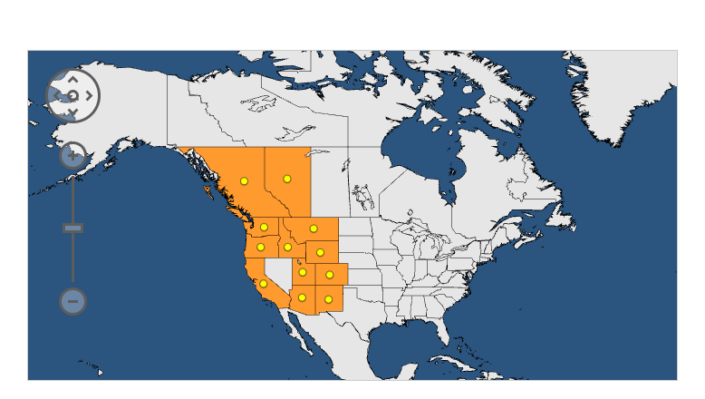

# **🔥 CHAR: Climate, Herbivory, and Risk 🌲🐛**
## **Investigating the Role of Spruce Budworm Outbreaks in Fire Vulnerability**

### **Team Members**
- Rachel Potter  
- Iris Mire  

---

## **Project Summary**
Spruce budworm (**Choristoneura occidentalis**) is a forest pest that weakens trees, increasing their susceptibility to wildfires. In this project, we examine the spatial dynamics of **Western spruce budworm outbreaks** and their role in **fire vulnerability** in the Pacific Northwest. Using geospatial analysis, climate data, and fire behavior modeling, we aim to identify key predictors of fire risk in infested forests.

🌍 **Range Map of the Western Spruce Budworm:**  

---

## **Background**
Western spruce budworms are defoliators that consume conifer needles, particularly in **spruce and fir forests**. Over several years of infestation (3–10 years), trees experience stress due to reduced foliage, potentially making them more flammable. However, herbivory may also reduce the amount of flammable material. Understanding how these outbreaks interact with climate variability and fire regimes is crucial for forest management and wildfire mitigation.

---

## **Questions & Objectives **
**Key Research Questions:**
- How do spruce budworm outbreaks influence fire vulnerability in Pacific Northwest forests?
- What spatial and temporal patterns exist in budworm outbreaks, and how do they correlate with climate variability? 
- Can fire behavior models predict changes in fire risk in budworm-affected forests?
- To what extent will patterns with the association between spruce-budworm and fire risk change under climate change?

Our objective is to analyze historical outbreak patterns, integrate climate and fire data, and assess fire vulnerability using geospatial approaches.

---

## **Datasets 📊**
We will use the following datasets:
- **🌲 Forest Health Monitoring Program (USDA Forest Service)** – [Link](https://www.fs.usda.gov/foresthealth/) (Budworm outbreak data)
- **🛰️ NASA MODIS (Terra/Aqua)** – [Link](https://modis.gsfc.nasa.gov/) (Satellite imagery for vegetation and fire detection)
- **🌡️ NOAA Climate Data** – [Link](https://www.ncdc.noaa.gov/) (Temperature, precipitation, and drought indices)
- **🔥 National Interagency Fire Center (NIFC)** – [Link](https://www.nifc.gov/) (Fire occurrence and severity data)
- **☁️ ECMWF Climate Reanalysis** – [Link](https://www.ecmwf.int/en/forecasts/datasets) (Long-term climate variability)

---

## **Tools & Packages 🛠️** 
We will conduct all analyses in **Python 🐍**, using the following libraries:
- **Geospatial Analysis**: `geopandas`, `rasterio`, `shapely`
- **Data Processing & Visualization**: `pandas`, `numpy`, `matplotlib`, `seaborn`
- **Machine Learning & Modeling**: `scikit-learn`, `xgboost`
- **Remote Sensing**: `Google Earth Engine (gee)`, `satpy`
- **Fire Behavior Modeling**: `FARSITE`, `FlamMap`

---

## **Methodology 📈**
1. **Data Collection & Cleaning**: Aggregate outbreak, fire, and climate data, ensuring temporal and spatial alignment.
2. **Geospatial Analysis**: Use remote sensing to map budworm infestations over time and integrate fire occurrence data.
3. **Climate Correlation**: Analyze climate trends and their relationship with outbreak severity.
4. **Fire Vulnerability Modeling**: Use fire behavior models and statistical techniques (e.g., Random Forest, regression) to assess fire risk in affected areas.
5. **Visualization & Interpretation**: Create maps, graphs, and statistical summaries to communicate findings.

---

## **Expected Outcomes**
🎯 **Goals we hope to achieve:**
- A comprehensive geospatial analysis of **budworm outbreaks** and their role in fire susceptibility.
- Identification of key climatic and ecological factors that drive **fire risk** in infested forests.
- Predictive models that could help **inform forest management and wildfire prevention strategies**.
- Open-source dataset and visualization tools for further research.

---

## **References**
📚 **Sources & Additional Reading:**
- USDA Forest Service: [https://www.fs.usda.gov/foresthealth/](https://www.fs.usda.gov/foresthealth/)
- MODIS Fire and Vegetation Data: [https://modis.gsfc.nasa.gov/](https://modis.gsfc.nasa.gov/)
- NOAA Climate Data: [https://www.ncdc.noaa.gov/](https://www.ncdc.noaa.gov/)
- National Interagency Fire Center: [https://www.nifc.gov/](https://www.nifc.gov/)
- ECMWF Climate Reanalysis: [https://www.ecmwf.int/en/forecasts/datasets](https://www.ecmwf.int/en/forecasts/datasets)

📖 **Relevant Academic Articles:**
- Fettig, C. J., et al. (2007). "Effects of climate change on insects and pathogens in coniferous forests of the western United States and Canada." Environmental Reviews, 15(1), 1-17. [DOI](https://doi.org/10.1139/a06-016)
- Howe, M., Hart, S. J., & Trowbridge, A. M. (2024). "Budworms, beetles and wildfire: Disturbance interactions influence the likelihood of insect-caused disturbances at a subcontinental scale." Global Change Biology [DOI](https://doi.org/10.1111/1365-2745.14408)
- Hummel, S., & Agee, J. K. (2003). "Western spruce budworm defoliation effects on fuel dynamics and potential fire behavior in mixed-conifer forests." Forest Ecology and Management, 186(1-3), 13-28. [DOI](https://doi.org/10.1016/S0378-1127(03)00228-2)
- Meigs, G. W., et al. (2016). "Do insect outbreaks reduce the severity of subsequent forest fires?" Environmental Research Letters, 11(4), 045008. [DOI](https://doi.org/10.1088/1748-9326/11/4/045008)
- Powell, D. C. (1994). Effects of the 1980s Western Spruce Budworm Outbreak on the Malheur National Forest in Northeastern Oregon (R6–FI&D–TP–12–94). United States Department of Agriculture, Forest Service, Pacific Northwest Region, Forest Insects and Diseases Group. [link](https://osu-wams-blogs-uploads.s3.amazonaws.com/blogs.dir/3942/files/2020/10/1994-Powell-Malheur-SpruceBudWorm_stelprdb5358589.pdf)
- Raffa, K. F., et al. (2008). "Cross-scale drivers of natural disturbances prone to anthropogenic amplification: The dynamics of bark beetle eruptions." BioScience, 58(6), 501-517. [DOI](https://doi.org/10.1641/B580607)

